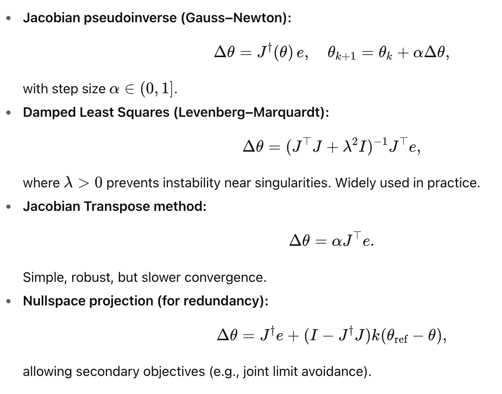
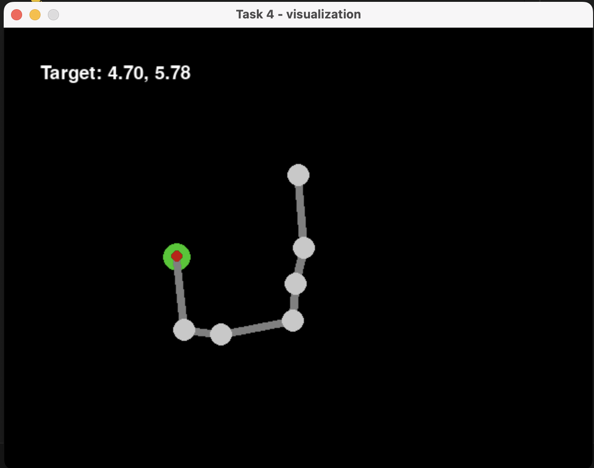
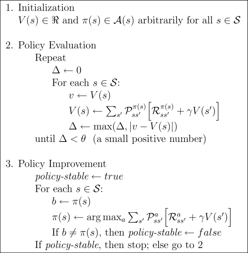
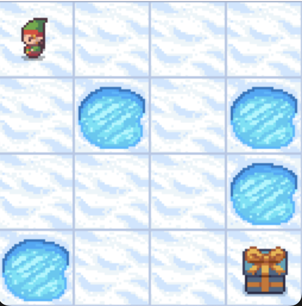
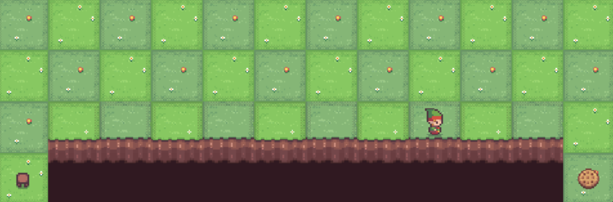

# Installation

Install a virtual environment:

```bash
python3 -m venv venv
source ./venv/bin/activate
```

Install requirements:

```bash
pip install -r requirements.txt
pip install -e .
```

# Tasks

## Task 0 - Forward Kinematics

Implement Forward Kinematics. Correct FK implementation should result in matching green and red traces of the robotic hand.

## Task 1/2/3 - Inverse Kinematics

Implement an IK-solver. 

1. Compute Jacobian - matrix of derivatives.
2. Implement Newton-Raphson method (Pseudoinverse), Levenberg-Marquardt (damped least squares) method, or Jacobian Transpose method. 10 extra points can be earned for implementing Nullspace projection method (e.g. for limits `[-pi, pi]`). In this case, please describe your implementation in the Piazza home assignment submission message. 

3. Implement IK - given a goal position of an end-effector, compute a configuration of angles of the joints.

All three tasks are similar, except for the number of links and joints in a hand. Have fun!


## Task 4 - Inverse Kinematics - interactive

An interactive demo of the same IK-solver. Make sure to experiment with it. Try unreachable setpoints, try moving faster or slower. This is the very best place to see the difference between various IK optimization methods. Be curious - compare them!


## Task 5 - Policy Iteration

Implement a policy iteration algorithm. It must solve two MDPs: [frozen lake](https://gymnasium.farama.org/environments/toy_text/frozen_lake/) and [cliff walking](https://gymnasium.farama.org/environments/toy_text/cliff_walking/).



